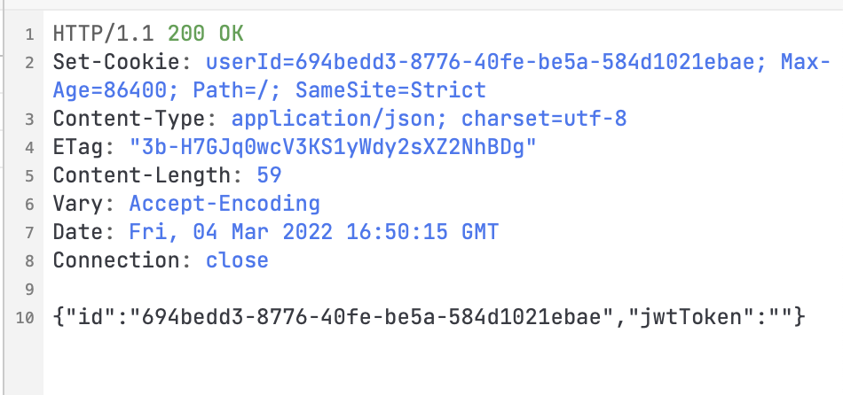
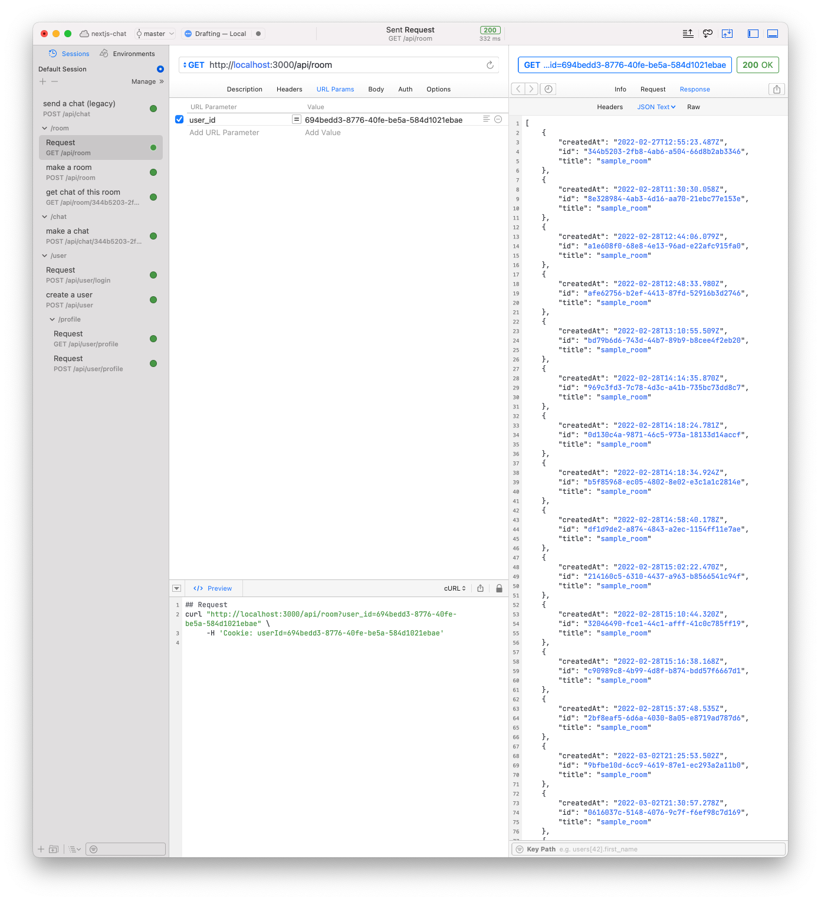
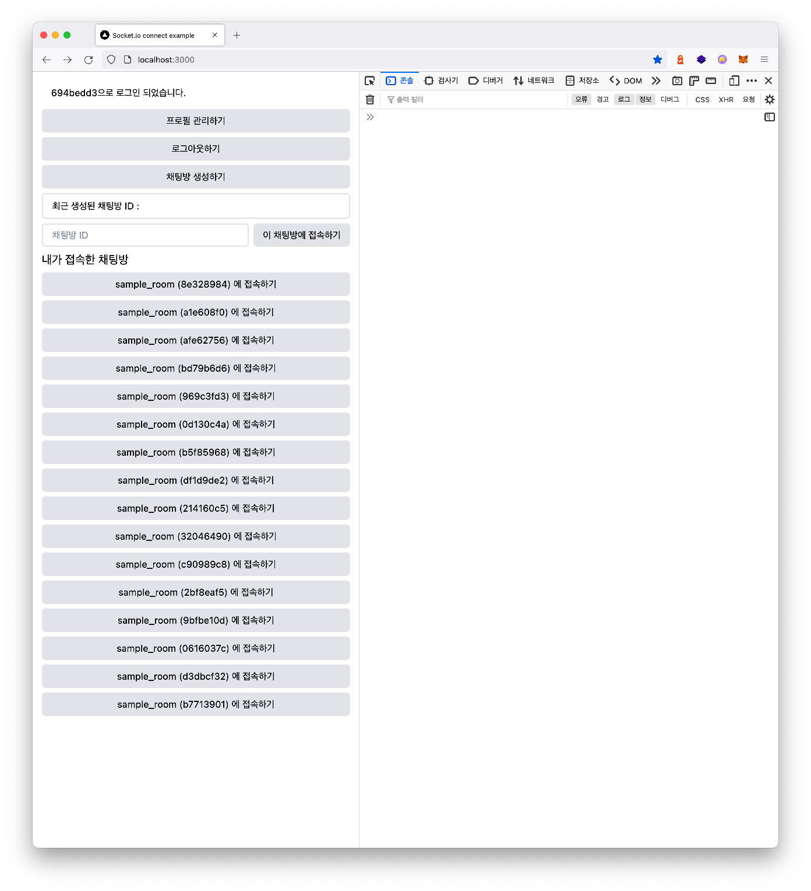

# 지난 시간 돌아보기 + 목표 설정하기

지난 시간에는 하드코딩된 유저 정보를 API를 사용한 로그인 기능과 기본적인 프로필 기능을 만들었습니다.

그리고 서비스를 사용해보면서 아래 [문제점](#문제점)과 같은 내용들을 발견하게 되었는데요.

이번 시간에는 저 문제점들을 해결해보는 시간을 가져보도록 하겠습니다.

그럼 오늘도 화이팅 !!!

## 문제점

지금 우리의 어플리케이션은 이런 문제를 가지고 있었습니다.

- 로그인을 한 상태로 새로고침을 하면 다시 로그인을 해야함
- 내가 접속한 채팅방에 다시 접속하려면 채팅방 ID를 기억해야 함
- 초대 기능이 없어서 다른 사람이랑 채팅을 하려면 그 사람이 채팅방에 초대되어야 함

## 진행사항

새로운 진행 목표('내가 접속한 채팅방의 목록을 확인할 수 있음')가 생겼습니다.

### 채팅 기능

- [x] socket.io를 사용한 1:1 채팅 기능
- [x] 유저끼리 한 채팅은 저장이 되어서 언제나 확인할 수 있음

### 프로필 기능

- [x] 사진, 이름등을 수정할 수 있는 프로필 기능

### 채팅방 기능

- [ ] 내가 접속한 채팅방의 목록을 확인할 수 있음

- [ ] 유저 목록을 확인해서 채팅을 생성할 수 있음

# 새로고침을 해도 세션을 유지시키는 기능 만들기

<video controls src="create-chat-app-with-nextjs-socketio-prisma-day-4/refresh_and_what.mov" style={{ width: "100%" }}></video>

(새로고침을 했더니... 세션이 사라졌다고...!?)

기존의 세션은 userContext 의 `userId` hooks에 저장되었습니다. 그렇다보니 새로고침 = 모든 변경점이 사라짐 이라는 웹의 특성에 의해서 사라졌는데요.
이 `userId` 를 로그인할 때 쿠키에 저장함으로써 새로고침을 해도 유저 정보가 사라지지 않도록 만들어보겠습니다.

## [cookies-next](https://www.npmjs.com/package/cookies-next) 라이브러리 추가하기

nextjs에서 쿠키를 조금 더 쉽게 다룰 수 있도록 도와주는 cookies-next 라이브러리를 추가합니다.

```bash
$ yarn add cookies-next
```

## `POST /user/login` 수정하기

로그인을 하면 유저의 ID를 쿠키에 추가해주는 기능을 추가했습니다.

```typescript
// ...
import { setCookies } from "cookies-next";

export default async (req: NextApiRequest, res: NextApiResponse) => {
  // ...

  setCookies("userId", response?.id, {
    req,
    res,
    sameSite: true,
    maxAge: 60 * 60 * 24,
  });

  // ...
};
```

API에 요청을 하면... Set-Cookie 헤더가 잘 들어가 있는 모습을 볼 수 있습니다.



## 새로고침을 했을 때 쿠키가 있다면 Context의 `userId` 값을 업데이트 하기

- UserContextProvider가 마운트 되었을 때 (페이지가 로드 되었을 때)

- Context 내부에 `userId`값이 없고
- 쿠키에 `userId` 에 대한 값이 있다면

`userId` 값을 업데이트 하는 기능을 추가했습니다.

```tsx
// ...

import { getCookies } from "cookies-next";

// ...

const UserContextProvider: FC = ({ children }) => {
  // ...

  useEffect(() => {
    // early return when userId is set
    if (!!userId) return;

    // get userId cookie and set userId
    const { userId: userIdCookie } = getCookies();
    if (!userIdCookie) return;

    setUserID(userIdCookie);
  }, [userId]);

  // ...
};

export default UserContextProvider;
```

이제 새로고침을 해도 유저 정보가 사라지지 않습니다 (만세!)

<video src="create-chat-app-with-nextjs-socketio-prisma-day-4/refresh_and_work.mov" controls width="100%;"></video>

또 로그아웃을 할 때 `userId` 쿠키를 삭제하는 기능도 추가했습니다.

```tsx
// ...

const UserContextProvider: FC = ({ children }) => {
  // ...

  function logout() {
    removeCookies("userId");
    // ...
  }

  // ...
};

export default UserContextProvider;
```

# 내가 접속한 채팅방 목록을 표시하기

이 문제는 생각보다 간단하게 해결할 수 있어보입니다.

사용자의 `userId` 를 받으면 해당 `userId`가 속해있는 Room을 데이터베이스에서 찾아서 반환하기만 하면 되기 때문이죠.

## `GET /room` 만들기

`userId` 를 쿼리로 받아 해당 유저가 현재 접속해 있는 채팅방 목록을 반환합니다.

```typescript
// ...

export default async (req: NextApiRequest, res: NextApiResponseServerIO) => {
  if (req.method === "GET") {
    const user_id = String(req.query.user_id);

    const response = await prisma.room.findMany({
      where: {
        users: {
          every: {
            user_id,
          },
        },
      },
    });

    return res.status(200).json(response);
  }

  // ...
};
```



API를 호출하면 정상적으로 해당 사용자가 접속한 채팅방이 반환됩니다.

## 다른 사용자가 채팅방에 접속해도 데이터베이스에 반영되지 않는 문제 해결하기

데이터베이스를 확인하던 도중 이상한 점을 발견했습니다.

저는 테스트 용도로 여러개의 방을 만들었고, 채팅방에는 적어도 2명 이상의 사용자가 채팅방에 접속했을텐데...

데이터베이스에서는 채팅방을 만든 유저만 기록되어 있었기 때문입니다.

![prisma studio에서 Room 테이블을 표시한 모습, users[] 배열에는 단 한명의 유저만 들어가 있다.](create-chat-app-with-nextjs-socketio-prisma-day-4/user_is_only_one_2.png)

### 백엔드에 유저가 방에 있는지 확인하는 로직 추가하기

그래서 채팅방에 접속할 때 `usersOnRoom` 에 `room_id` 와 `user_id` 값이 있는지(방에 접속한 적이 있는지) 확인한 다음, 만약 없다면 방에 추가해주는 기능을 작업했습니다.

```typescript
// ...

export default async (req: NextApiRequest, res: NextApiResponseServerIO) => {
  const { room_id, user_id } = req.query;

  // ...
  await prisma.$transaction(async (p) => {
    // check if user joined rooms
    const { _count: row } = await p.usersOnRoom.aggregate({
      where: {
        room_id: String(room_id),
        user_id: String(user_id),
      },
      _count: true,
    });

    // create usersOnRoom row
    if (row === 0) {
      await p.usersOnRoom.create({
        data: {
          room_id: String(room_id),
          user_id: String(user_id),
        },
      });
    }
  });
  // ...
};
```

이제 API 요청을 보내면...

```bash
$ curl "http://localhost:3000/api/room/{room_id}?user_id={user_id}"
```

성공적으로 방에 추가가 된 것을 확인할 수 있습니다.


### 바뀐 API 스펙에 대응하기

사용자가 `/room/[room_id]`에 접속하면 쿠키의 `userId` 값을 가져와서 API 요청을 하는 부분도 수정 했습니다.

```typescript
// ...

import { getCookies } from "cookies-next";

// ...

export const getServerSideProps: GetServerSideProps<IProps> = async (ctx) => {
  // ...
  const { userId } = getCookies(ctx);

  await fetch(`http://localhost:3000/api/room/${room_id}?user_id=${userId}`, {
    method: "GET",
  });

  // ...

  return {
    props: {
      room_id,
      msg,
    },
  };
};
```

## `Room` 타입 추가하기

```typescript
export type Room = {
  id: string;
  title: string;
  createdAt: string;
};
```

## 프론트엔드에 연결하기

사용자가 홈 페이지에 접속하면 API를 호출해서 채팅방 목록을 가져오는 기능을 작업했습니다.

```tsx
// ...

import { Room } from "types/rooms";

async function getMyRooms(user_id: string) {
  const response = await fetch(
    `http://localhost:3000/api/room?user_id=${user_id}`,
    {
      method: "GET",
    }
  );
  return await response.json();
}

const Home: NextPage = () => {
  // ...
  const [rooms, setRooms] = useState<Room[]>([]);

  useEffect(() => {
    if (!userId) return;
    getMyRooms(userId).then((response) => setRooms(response));
  }, [userId]);

  // ...

  return (
    <>
      {/* ... */}
      <main
        className={"flex flex-col gap-y-2 p-4 w-full h-screen border-gray-200"}
      >
        {/* ... */}
        <div className={"flex flex-col gap-y-2"}>
          <h1 className={"text-xl"}>내가 접속한 채팅방</h1>
          {rooms.map((room) => (
            <button
              onClick={() => push(`/room/${room.id}`)}
              className={"px-4 py-2 bg-gray-200 rounded-md"}
              key={room.id}
            >
              {room.title} ({room.id.slice(0, 8)}) 에 접속하기
            </button>
          ))}
        </div>
      </main>
    </>
  );
};

export default Home;
```



정상적으로 작동하는 것을 확인할 수 있습니다.

# 회고와 예고

원래는 사용자를 초대하는 기능까지 같이 작업하려고 했지만...

그 전에 socket.io와 관련되어서 구조의 수정이 필요할 것 같아 다다음화쯤으로 미루게 되었습니다.

다음화에는 아마 이런 기능들을 할 것 같습니다.

- 클라이언트 socket 클라이언트를 Context로 분리하기
- [socket.io 공식 문서](https://socket.io/get-started/private-messaging-part-1/) 참고해서 클라이언트 구조 개선하기
- socket.io와 관련되어서 백엔드 로직 수정하기

긴 글 읽어주셔서 감사합니다.

안녕히 주무세요 👋
