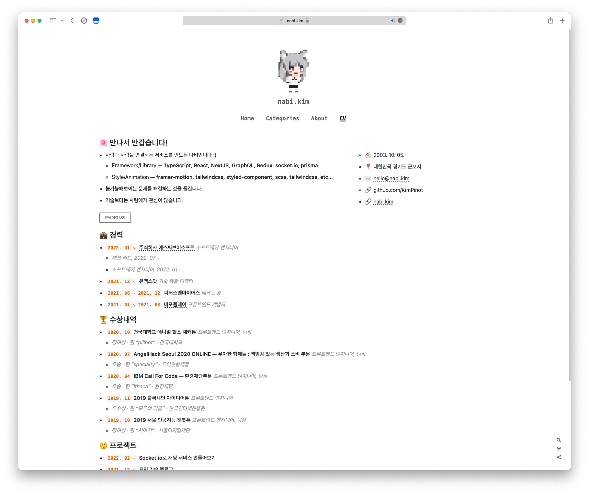
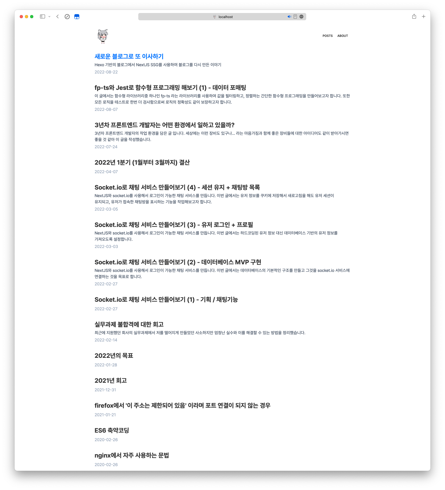

안녕하세요. 블로그를 또 만드는 개발자 나비입니다.
이번 시간에는 Hexo 기반의 블로그에서 NextJS 기반으로 블로그를 옮기게 된 계기와 어떻게 만들어졌는가를 적어보고자 합니다.

# TL;DR

- 하지 마세요
- 정말 할꺼라면 Gatsby 쓰세요
- 사실 Hexo가 가장 좋아요

# 사건의 발단

이력서 페이지를 만들면서 생긴 일이였습니다.



기록하지는 않았지만, 이 페이지에서 전체 이력 보기 버튼을 만들면서 크게 고생을 했었는데요.
마크다운에서는 기본적으로 HTML 기능을 지원하지 않기 때문에...
마크다운 파일에 HTML 태그를 넣고 장인의 마음가짐으로 한땀한땀 만들었었습니다.

그러다 보니 불편한 점이 한 두개가 아니였는데...

1. 직접 만드는게 불편하다.
2. 마크다운 말고 리액트 컴포넌트로 짜면 금방 짤 수 있었다.
3. 그냥 귀찮다.

그래서 내린 결론은...

# 블로그를 옮기자!

블로그를 옮기면서, 나름대로 작은 조건들을 걸어두었습니다.

- 개발을 하더라도 최소한으로 해야한다
- 마크다운을 지원해야한다. MDX를 지원하면 베스트
- 포스트를 만들고 관리하는데에 귀찮지 않아야 한다
- **디자인이 이뻐야 한다**

그래서 나오게 된 후보군이 이렇게 있었습니다.

| 플랫폼 이름 | 장점                                                                                         | 단점                                                                                                                       |
| ----------- | -------------------------------------------------------------------------------------------- | -------------------------------------------------------------------------------------------------------------------------- |
| Gatsby      | - 개발이 빠르다 <br /> - 플러그인이 많다 <br /> - 문제가 생겼을때 해결할 수 있는 문서가 많다 | - 내가 모르는 부분에 대부분의 로직을 기대야 한다 <br /> - 파일의 구조가 복잡하다 (= 포스트를 만들고 관리하는데 귀찮아진다) |
| Hexo        | - 이쁜 테마가 많다 <br /> - 포스트 관리가 간편하다                                           | - MDX를 지원 하지 않는다 <br /> - 여기에 실증이 났었다 <br /> - jQuery를 아직도 쓴다                                       |
| Velog       | - 개발을 하지 않아도 된다 <br /> - 좋은 글들이 많이 있다                                     | - 커스텀이 하나도 안된다                                                                                                   |
| 티스토리    | - 개발을 하지 않아도 된다 <br /> - 웹에디팅을 지원한다                                       | - 코드 지원의 상태가 좋지 않다                                                                                             |
| 직접 만든다 | - 내가 모든 로직을 만들 수 있다                                                              | - 모든 로직을 내가 만들어야 한다                                                                                           |

결과적으로는, **직접 만든다** 를 선택하게 되었는데요. 그 이유는...

- 블로그 디자인을 해보고 싶었다.
- Gatsby도 좋지만, 파일 구조가 복잡했다.
- Velog, 티스토리도 좋지만 커스텀 자체가 불가능하거나 어려웠다.
- MDX 지원하는 블로그가 없다
- 함수형 프로그래밍으로 블로그 만들어보고 싶었다

# #가보자고

우선 템플릿은 회사에서 있던 NextJS + TailwindCSS + DaisyUI 템플릿을 사용하여 기초를 다졌습니다.

그리고 SSG를 위해 파일을 가져오는 로직을 다음과 같이 만들었습니다.

```typescript
import * as F from "fp-ts/function";
import * as A from "fp-ts/Array";

import { isNotJunk } from "junk";
import { readdir } from "fs/promises";
import { getMetadata } from "./article";
import { promiseAll } from "modules/utils/promise";

const isNotFolder = (i: Dirent) => !i.isDirectory();
const keepNotListHidden = (i: Metadata) => !i.hide?.list;

const getFilenames = async () =>
  F.pipe(
    // post 폴더에서 전체 파일을 가져온다
    await readdir("./posts", { withFileTypes: true }),
    // 폴더가 아닌, 파일만 가져온다
    A.filter(isNotFolder),
    // 배열에서 이름'만' 가져온다
    A.map(pick("name")),
    // Junk (.DS_Store 같은거) 파일을 제외한다
    A.filter(isNotJunk),
    // .md 또는 .mdx 확장을 지운다
    A.map(deleteMdFileExtension)
  );

export const getPosts = async () =>
  F.pipe(
    await getFilenames(),
    // 메타데이터를 가져온다
    A.map(getMetadata),
    // promise를 모두 실행시킨다
    promiseAll
  );
```

빌드 과정에서 SSG를 통해 static file로 만들어지기 때문에 파일을 가져오거나, 렌더링 하는 부분에서의 최적화는 신경쓰지 않았습니다.

그리고 아래와 같이 getStaticProps을 사용하여 데이터를 가져오게 하면,
NextJS 페이지 Prop에 article의 메타데이터를 담은 블로그 글이 나오게 될것입니다.

```typescript
export const getStaticProps: GetStaticProps = async () => {
  return {
    props: {
      articles: await getSortedPosts(),
    },
  };
};
```

## 아니 이게 뭐야

빌드가 안됩니다.

```text
Error: Error serializing `.meta.date` returned from `getStaticProps` in "/[filename]".
Reason: `object` ("[object Date]") cannot be serialized as JSON.
Please only return JSON serializable data types.
```

구글에 검색해봅니다.

> Looks like nextJS doesn't like serializing anything but scalar types for performance reasons.
> You can read more in this github issue.
> Best way you can handle this is that you convert your Date objects to UNIX timestamp before returning them.

아하! NextJS에서는 퍼포먼스를 위해 SSR / SSG 단계에서 Date, Map, Set 과 같은 특정 타입의 변환을 지원하지 않는다고 합니다.
그러면 메타데이터의 타입을 number로 바꾸면 동작한다는 뜻이기도 합니다.

```typescript
import * as F from "fp-ts/function";
import { joinObject, pick } from "modules/utils/object";

export async function getMetadata(
  filename: string
): Promise<MetaDataWithFilename> {
  const { date, ...rest } = F.pipe(
    await filenameToRender(filename),
    pick("frontmatter"),
    joinObject({ filename })
  );
  return {
    ...rest,
    date: +date,
  };
}
```

잘 동작합니다.

## 이건 왜 이래

이제는 시간이 이상합니다.

이 글의 작성일자는 `2022년 08월 22일 13시 31분 06초` 인데요.
하지만, 현재 블로그에는 이렇게 값이 표시되고 있습니다.


잠시만요. 9시간?

UTC 타임을 기준으로 한국은 +9 시간의 시차가 있습니다.
제가 마크다운의 메타데이터를 파싱할때에는 [jonschlinkert/gray-matter](https://github.com/jonschlinkert/gray-matter) 라이브러리를 사용하는데요.

https://github.com/vuejs/vuepress/issues/2104 에 따르면 YAML의 시간은 기본적으로 UTC 시간을 기준으로 설정된다고 합니다.

그러면 타임존과 관련된 수정사항을 도와주는 유틸 함수를 하나 만들면 더 편해질 것 같네요.

```typescript
export function dateWithoutTimezone(date: number) {
  const _ = new Date(date);
  return new Date(_.valueOf() + _.getTimezoneOffset() * 60 * 1000);
}
```

이제 잘 출력됩니다! (만세!)

# 결과



결과적으로는, 뭐 잘 된거 같습니다.
아직 실 서비스에서 적용하기에는 조금 애매한 것들 (CV 페이지의 부재, 카테고리나 태그가 없음) 이 많아서...
기능들 다 만들기 전까지는 [new.nabi.kim](https://new.nabi.kim) 도메인으로 계속 연결해둘 생각입니다.

언젠가 적용될 이 블로그를 마음껏 즐겨주세요!
